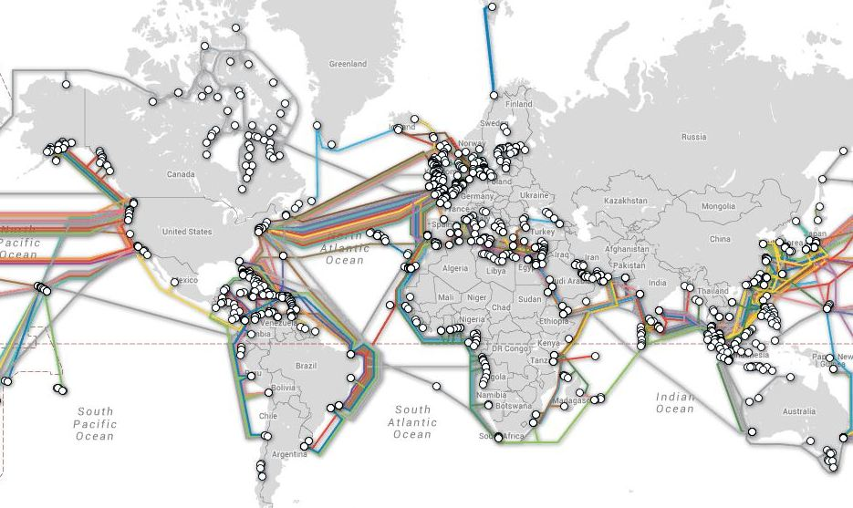
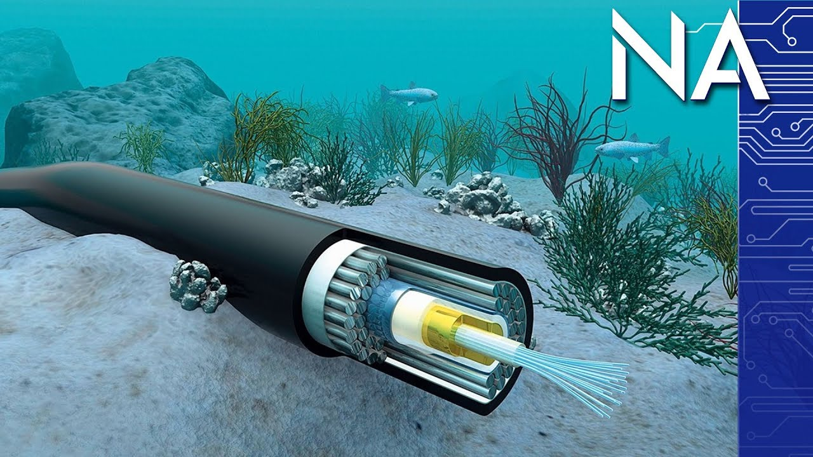
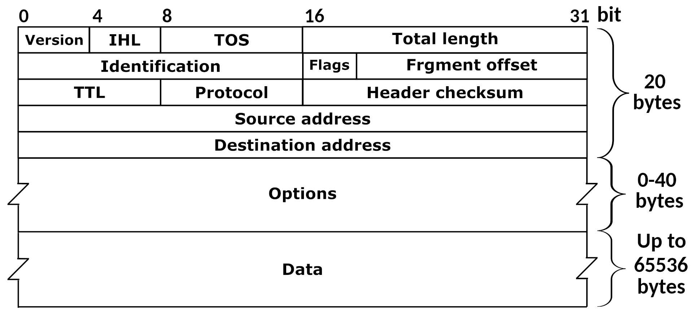

# Create a Magic 8-Ball using Web Technology

## Objective

The goal of this course is to learn about what the internet is and how it works. First, we'll take a look at the physical component of the internet. Then we'll take a look at the software side of the internet and relate it to the physical component. We'll create three magic eightball applications to demonstrate the internet at various levels.

## Sending Notes In the Classroom &mdash; The First Internet?

Imagine two girls, Anna and Belle, are sitting in a classroom during school. The teacher is in the middle of a lecture and Anna cannot wait to talk to Belle, who is sitting on the other side of the classroom, about the latest Pokemon game. Anna cannot get up and walk over to Belle, otherwise the teacher is sure to notice and send Anna back to her seat.

But luckily, that won't stop Anna from being able to communicate with Belle. Instead, she writes down all the things that she wants to tell Belle onto index cards. On the reverse side of each index card, she writes Belle's name on them.

Then, when the teacher looks away, Anna hands the index card to the student sitting next to her. That student is a team player, and will look at the name on the back of it and quietly says: "no problem! I'll pass it along". That student then sends it to the next student, and then that student to the next, and so on. Eventually the index card reaches Belle, who can then turn over the index card and read it.

Anna repeats this process for each index card, until Belle eventually gets the full message.

This entire process of sending notes in the classroom is eerily similar to the way that the internet works. Let's see why that is!

First, Anna has a message. She writes that message down in a way that can be transported to Belle. In this case, she writes the message down on an index card.

Next, there is an entire network of students that are willing and ready to transport the message to the intended recipient. Notice that the students really can only transport messages to nearby students. This eliminates the need for each student to have to transport messages to each other, as they can instead rely on other students to help deliver the message. 

It is also important that the index card has Belle's name on it. This way, the student can look at the message itself to see where it needs to go. In fact, this works in a classroom where students don't even know each other's name. They can simply pass the index card to another student at random if it's not their message, and eventually it will find its way to Belle. (It's also possible for the message to be lost.)

Belle is an active participant in this network as well, not only as the reader of this message, but as a potential student who can pass notes sent by other students to their intended recipients.

## The Physical Internet

Let's step outside of the classroom now and look at what the internet is. The internet consists of computers that are connected together using wired (or occasionally wireless) connections, and other devices that are used to help messages travel efficiently.

Each computer is a complex machine that consists of many electronic components. A computer is capable of creating and storing a message, either directly written by a person or indirectly by a computer program. Those messages all share one thing in common: at their most rudimentary level they are all arrangements of binary.

One such component of the computer is the network card. The network card is responsible for taking a binary arrangement and transmitting electrical signals onto ethernet cables, which will connect to other devices and so on. This device serves as the basis of sending data from one device to another. Another such component is a wifi card. This essentially serves the same function as the network card, but instead of using wired ethernet cables to transmit data, they use Wifi signals, which are based off of microwaves. When using an ethernet cable as transport, we'll say you're using a wired adapter. When using Wifi, we'll say you're using a wireless adapter. In either case, we'll use the generic term network adapter instead.

Random fact: Microwave ovens cook food at frequencies of 2.3 GHz. Your typical Wifi connection is 2.4 GHz. So why doesn't Wifi cook things? The answer is in the amount of power used to emit the microwaves. Microwave ovens use a lot more power, and have their waves focused in a single direction. Microwave ovens draw from about 1000 Watts of power, whereas Wifi microwaves draw from about 0.1 Watts of power. 

So now we know that devices are capable of holding binary messages, and we can use network adapters to transmit messages. Now let's talk about how these things can fit together.

Network adapters can send signals short distances. Whether it be wired or wireless, signals eventually degrade over time. You simply cannot connect two devices that are far away using a wired connection or a wireless connection because the message would be lost due to physical reasons.

To solve that issue, we need more devices. We can send signals between devices that are relatively close without loss of quality, and then repeat this. One such device is called a switch. A switch is a device that accepts several ethernet wires as input, and connects them to each other. This allows us to send messages from switch to switch without worrying about the quality of the message from being degraded. For Wifi signals, instead of switches we have repeaters that serve the same purpose.

Additionally, switches serve another function. A switch allows multiple ethernet cables to connect to each other, allowing for messages to travel from any computer connecting to the switch to any other. Whenever we have multiple devices connected to each other, we say that those devices are in a network with each other. 

Devices that in the same physical network are said to be in a local area network (or LAN). These devices can directly send messages to each other, provided the device is accepting messages. However, they still cannot talk to computers outside of the network. To do this, that computer needs to be connected to the internet.

To connect to the internet, there needs to be a device, called a router, on the internet that is physically connected to the internet. The router is responsible for messages to flow into the network from the internet, and for messages coming from inside of the network to go to the internet.

Additionally, that router needs to be enabled to connect to the internet from a company called an internet service provider who specializes in providing internet access. Without the internet service provider granting the router (and thus the network) access to the rest of the internet, the network will not be connected to the internet.

How does the internet service provider work? Essentially in the same way that a local network works. The internet service provider is tasked with setting up networks of physical devices and cables that can deliver on the promise of delivering messages from your network to an intended network target.

Fun fact: 
There are over 885,000 kilometers of cable that exist underneath the ocean to connect internet networks on different continents. These cables are about as wide as a garden hose.





## Internet Protocol

Now that we have a concept of networks (big and small), we need to talk about how we send messages to a specific computer. When sending a message in the classroom, Anna had written Belle's name on the back of the index card in order to signify to the other classmates delivering the message was intended for Belle. Is there a similar concept for a computer on the network?

Well, there's two separate ways. The first is that each network device has a name, called a MAC Address. This name is unique to each device and is the same regardless of where that device is on the network. This is similar to Belle's name. Belle will always have her name regardless of where she's sitting in the classroom.

The second way is to have an arbitrary address based on where the computer is on the network. Imagine in the classroom that every desk was given a unique number. Someone was responsible for assigning each desk this number, and there's no reason in the future that desks will be given the same number. If Belle was sitting at desk 23, then Anna could have instead written 23 on the back of the index card and had it delivered to desk 23 instead, where Belle happened to be sitting. 

For network devices, this type of way of finding out a device is called the IP address. Each computer on a network is assigned an IP address when it is connected to the network. On a network, the IP address ultimately leads to a MAC Address.

For the purposes of the internet, the IP address is used to communicate messages from devices. We send messages to different IP addresses. Once the message is correctly routed to the right network, the IP address is then resolved to a MAC address, and the message is delivered to the network interface with that MAC address.

Some devices can belong to more than one network and have an IP address that only has meaning inside of that network. The router, for example, sits inside of the local area network, but also the wide area network of the internet service provider. When a message is sent from your computer to a computer on the internet, it is directed to your router because it doesn't match any computer on your network. The router then sends it along the network of the internet service provider. Eventually this process repeats itself until the message is delivered to the end route (or for some reason the message cannot be delivered).

Now that we know who to send messages to, how do we send messages? The answer is that the internet program will take a message and divide it into datagrams. A datagram is simply a string of bytes with a particular format. These packages are arranged as binary information and then sent to the network card to be transmitted to the rest of the network.



## TCP Protocol

Although the Internet Protocol defines the internet, it is not used by itself. Instead, it is part of a larger suite of protocols called the TCP/IP Protocol Suite. TCP stands for the "Transmission Control Protocol" and uses the Internet Protocol to send messages. However, the TCP Protocol adds more to the equation, allowing for stable connections to be established between two devices.

The Internet Protocol is a message sending technique that can be described as "fire and forget". The sender has no idea that the message reaches its destination. 

TCP solves this among other problems by first establishing a connection between two devices. What is a connection? A connection is simply a state controlled by programs that indicate that the servers have sent and received messages.

To establish a TCP connection, a TCP handshake occurs. A TCP handshake involves sending a message to a recipient. The recipient receives the message and then sends back a reply saying that the recipient receives the message, and then the original sender replies to this acknowledging that they received the message. It would be silly to consider this further, but once this occurs a TCP connection is said to be established.

Further, TCP adds a level of acknowledgement for every message it sends in a way that is similar to the handshake. After the handshake occurs, and a message is sent, the server sends the message and waits for an acknowledgement from the receiver. If the receiver receives the message, then it sends back an acknowledgment back to the sender. If the receiver doesn't acknowledge within a certain timeframe, the TCP sender will resend the message. If the receiver receives a duplicate message, it sends another acknowledgement, but it recognizes that this message should have only been sent once and will ignore copies.

TCP adds other properties to this connection as well that are beyond the scope of this discussion. Feel free to read more into it.

## Exercise 1 - Magic 8-Ball TCP Server

Now that we have an idea of what TCP is, let's try and create our first Magic 8-ball application! Please click the link below to get started!

[Magic 8-Ball TCP Server](exercise-1/README.md)

## HTTP - the Hypertext Transfer Protocol

TCP is important to discuss as it is one of the major building blocks of the internet. However, most communication over the internet does not happen over TCP. Instead, there is a protocol built on top of TCP that is used to send a special kind of text request. This protocol is called the Hypertext Transfer Protocol (HTTP), and it serves as the basis for all web browser communication.

As mentioned before, HTTP is built on top of TCP. HTTP has multiple versions: HTTP 1.0, HTTP 1.1, and HTTP 2.0. For this discussion we'll talk about the slightly older version of HTTP 1.1. HTTP 2.0 takes the concepts of HTTP 1.1 and makes the more efficient, but it does so at the cost of making it slightly harder to understand. We'll focus on HTTP 1.1 for simplicity.

HTTP sends text messages over TCP in a way that was similar to the way the Magic 8-ball questions were sent to the server we built in exercise-1. The HTTP Message has a format that looks like this

```http
GET /relative-path HTTP/1.1  
Accept: */*
Host: 127.0.0.1:80
<blank line>
<any body of bytes>
```

There are a few generally accepted HTTP Verbs, including but not limited to GET, POST, PUT, PATCH, DELETE, HEAD, OPTIONS, CONNECT. These VERBS tend to have very specific ideas behind their usage and what to expect. The most important HTTP Verbs are GET and POST.

A GET request is one that doesn't have a body, and is sent with the intention of fetching a resource from a server. A POST request is typically used to submit data to a server for processing. Other VERBS have different meanings and usages to them, but we will not discuss those here.

Here is an example, handwritten request to http://www.google.com

```http
GET / HTTP/1.1
Accept: */*
Host: www.google.com:80
User-Agent: handwritten
Connection: close


```

If you connect to google's http server with a TCP connection and send this message, you'll receive a reply from the server with the same response that you would receive by going to http://www.google.com in your web browser.

Just like there is a common format for an HTTP request, there is a common format for an HTTP response. Here is the response from the google message

```http
HTTP/1.1 200 OK
Date: Fri, 25 Feb 2022 16:13:15 GMT
Expires: -1
Cache-Control: private, max-age=0
Content-Type: text/html; charset=ISO-8859-1
P3P: CP="This is not a P3P policy! See g.co/p3phelp for more info."
Server: gws
X-XSS-Protection: 0
X-Frame-Options: SAMEORIGIN
Set-Cookie: 1P_JAR=2022-02-25-16; expires=Sun, 27-Mar-2022 16:13:15 GMT; path=/; domain=.google.com; Secure
Set-Cookie: NID=511=jC5W-an7F7LYoMCHGj0dvscMv-QIK7Qn-Q9d-_3V3AgH3NdWSIQHAicYtYwmJmLflvVtwbx19nY9Ey-7eiy0dCDyi-0t_MC-CuZRh8T70pqe9P80WguFtEdTbq7UAKuaIuYFYHSQVPT1voNVkDXB1br_7xX0wLuDiOoq5C8i0xQ; expires=Sat, 27-Aug-2022 16:13:15 GMT; path=/; domain=.google.com; HttpOnly
Accept-Ranges: none
Vary: Accept-Encoding
Connection: close
Transfer-Encoding: chunked

2f83
<!doctype html><html itemscope="" itemtype="http://schema.org/WebPage" lang="en"><head><meta content="Search the world's information, including webpages, images, videos and more. Google has many special features to help you find exactly what you're looking for." name="description"><meta content="noodp" name="robots"><meta content="text/html; charset=UTF-8" http-equiv="Content-Type"><meta content="/images/branding/googleg/1x/googleg_standard_color_128dp.png" itemprop="image"><title>Google</title><script nonce="NEjGiIeIqYRtTC/y3CsW/g==">(function(){window.google={kEI:'GwAZYp_UMqGIytMPnrKkyA8',kEXPI:'0,202450,3,1100083,56873,6058,207,4804,2316,383,246,5,1354,4013,923,315,1122515,1197729,694,380068,16114,17444,11240,17572,4859,1361,9291,3022,4751,12835,4020,978,13124,104,3847,4192,6430,22741,5081,1593,1279,2742,149,1103,840,1983,214,4100,3514,606,2024,1776,520,14670,3227,2845,7,4774,825,11851,8102,6294,1925,1850,15324,432,3,346,1244,1,5444,151,11321,2652,4,1528,2304,7039,20309,1714,3050,2658,7357,30,13628,2305,675,1457,15351,1435,5830,2527,4094,4052,3,3541,1,14711,2096,21582,3771,2,14016,1931,442,342,255,2993,1557,744,5852,10463,1160,5679,1020,2380,2719,18297,1,8,7717,4568,6253,6723,1,10727,5974,1251,5835,14967,4333,2204,2083,390,1413,689,705,445,2,2,1,1509,1940,2946,6103,4823,300,1,2,6117,2,40,845,1557,10,1,436,1047,4729,2068,311,113,625,5,1517,3377,945,100,468,230,1,2,3,457,2,1015,1563,859,3596,2974,421,880,327,1562,1019,255,753,4491,687,434,733,2,65,286,1276,563,1,258,823,117,1,8,1100,4,104,630,57,1258,3,275,489,472,188,3,1663,183,20,1209,833,163,80,417,1093,4,79,431,58,218,122,807,223,437,349,93,209,468,261,151,699,109,151,86,968,677,3,1,302,1460,4,1,5472800,101,829,21,248,5995595,2801217,882,444,1,2,1877,1,2562,1,748,141,795,563,1,4265,1,1,2,1331,4142,2609,155,17,13,72,139,4,2,20,2,169,13,19,46,5,39,96,548,29,2,2,1,2,1,2,2,7,4,1,2,2,2,2,2,2,353,513,186,1,1,158,3,2,2,2,2,2,4,2,3,3,269,1601,141,423,153,74,254,3,35,7,53,23951978,2862027,1176548,3,3112,3,450,1964,1008,483,9,1435,159,1358,4726,3,923,32,3,1704,2,2918,609,1561,269,876210',kBL:'AC2n'};google.sn='webhp';goog
le.kHL='en';})();(function(){
var f=this||self;var h,k=[];function l(a){for(var b;a&&(!a.getAttribute||!(b=a.getAttribute("eid")));)a=a.parentNode;return b||h}function m(a){for(var b=null;a&&(!a.getAttribute||!(b=a.getAttribute("leid")));)a=a.parentNode;return b}
function n(a,b,c,d,g){var e="";c||-1!==b.search("&ei=")||(e="&ei="+l(d),-1===b.search("&lei=")&&(d=m(d))&&(e+="&lei="+d));d="";!c&&f._cshid&&-1===b.search("&cshid=")&&"slh"!==a&&(d="&cshid="+f._cshid);c=c||"/"+(g||"gen_204")+"?atyp=i&ct="+a+"&cad="+b+e+"&zx="+Date.now()+d;/^http:/i.test(c)&&"https:"===window.location.protocol&&(google.ml&&google.ml(Error("a"),!1,{src:c,glmm:1}),c="");return c};h=google.kEI;google.getEI=l;google.getLEI=m;google.ml=function(){return null};google.log=function(a,b,c,d,g){if(c=n(a,b,c,d,g)){a=new Image;var e=k.length;k[e]=a;a.onerror=a.onload=a.onabort=function(){delete k[e]};a.src=c}};google.logUrl=n;}).call(this);(function(){
google.y={};google.sy=[];google.x=function(a,b){if(a)var c=a.id;else{do c=Math.random();while(google.y[c])}google.y[c]=[a,b];return!1};google.sx=function(a){google.sy.push(a)};google.lm=[];google.plm=function(a){google.lm.push.apply(google.lm,a)};google.lq=[];google.load=function(a,b,c){google.lq.push([[a],b,c])};google.loadAll=function(a,b){google.lq.push([a,b])};google.bx=!1;google.lx=function(){};}).call(this);google.f={};(function(){
document.documentElement.addEventListener("submit",function(b){var a;if(a=b.target){var c=a.getAttribute("data-submitfalse");a="1"===c||"q"===c&&!a.elements.q.value?!0:!1}else a=!1;a&&(b.preventDefault(),b.stopPropagation())},!0);document.documentElement.addEventListener("click",function(b){var a;a:{for(a=b.target;a&&a!==document.documentElement;a=a.parentElement)if("A"===a.tagName){a="1"===a.getAttribute("data-nohref");break a}a=!1}a&&b.preventDefault()},!0);}).call(this);</script><style>#gbar,#guser{font-size:13px;padding-top:1px !important;}#gbar{height:22px}#guser{padding-bottom:7px !important;text-align:right}.gbh,.gbd{border-top:1px solid #c9d7f1;font-size:1px}.gbh{height:0;position:absolute;top:24px;width:100%}@media all{.gb1{height:22px;margin-right:.5em;vertical-align:top}#gbar{float:left}}a.gb1,a.gb4{text-decoration:underline !important}a.gb1,a.gb4{color:#00c !important}.gbi .gb4{color:#dd8e27 !important}.gbf .gb4{color:#900 !important}
</style><style>body,td,a,p,.h{font-family:arial,sans-serif}body{margin:0;overflow-y:scroll}#gog{padding:3px 8px 0}td{line-height:.8em}.gac_m td{line-height:17px}form{margin-bottom:20px}.h{color:#1558d6}em{font-weight:bold;font-style:normal}.lst{height:25px;width:496px}.gsfi,.lst{font:18px arial,sans-serif}.gsfs{font:17px arial,sans-serif}.ds{display:inline-box;display:inline-block;margin:3px 0 4px;margin-left:4px}input{font-family:inherit}body{background:#fff;color:#000}a{color:#4b11a8;text-decoration:none}a:hover,a:active{text-decoration:underline}.fl a{color:#1558d6}a:visited{color:#4b11a8}.sblc{padding-top:5px}.sblc a{display:block;margin:2px 0;margin-left:13px;font-size:11px}.lsbb{background:#f8f9fa;border:solid 1px;border-color:#dadce0 #70757a #70757a #dadce0;height:30px}.lsbb{display:block}#WqQANb a{display:inline-block;margin:0 12px}.lsb{background:url(/images/nav_logo229.png) 0 -261px repeat-x;border:none;color:#000;cursor:pointer;height:30px;margin:0;outline:0;font:15px arial,sans-serif;vertical-align:top}.lsb:active{background:#dadce0}.lst:focus{outline:none}</style><script nonce="NEjGiIeIqYRtTC/y3CsW/g==">(function(){window.google.erd={jsr:1,bv:1538,de:true};
var f=this||self;var g,h,k=null!==(g=f.mei)&&void 0!==g?g:1,l=null!==(h=f.sdo)&&void 0!==h?h:!0,p=0,q,r=google.erd,u=r.jsr;google.ml=function(a,b,d,m,c){c=void 0===c?2:c;b&&(q=a&&a.message);if(google.dl)return google.dl(a,c,d),null;if(0>u){window.console&&console.error(a,d);if(-2===u)throw a;b=!1}else b=!a||!a.message||"Error loading script"===a.message||p>=k&&!m?!1:!0;if(!b)return null;p++;d=d||{};var e=c;c=encodeURIComponent;b="/gen_204?atyp=i&ei="+c(google.kEI);google.kEXPI&&(b+="&jexpid="+c(google.kEXPI));b+="&srcpg="+c(google.sn)+"&jsr="+c(r.jsr)+"&bver="+c(r.bv)+("&jsel="+e);e=a.lineNumber;void 0!==e&&(b+="&line="+
e);var n=a.fileName;n&&(b+="&script="+c(n),e&&n===window.location.href&&(e=document.documentElement.outerHTML.split("\n")[e],b+="&cad="+c(e?e.substring(0,300):"No script found.")));for(var t in d)b+="&",b+=c(t),b+="=",b+=c(d[t]);b=b+"&emsg="+c(a.name+": "+a.message);b=b+"&jsst="+c(a.stack||"N/A");12288<=b.length&&(b=b.substr(0,12288));a=b;m||google.log(0,"",a);return a};window.onerror=function(a,b,d,m,c){q!==a&&(a=c instanceof Error?c:Error(a),void 0===d||"lineNumber"in a||(a.lineNumber=d),void 0===b||"fileName"in a||(a.fileName=b),google.ml(a,!1,void 0,!1,"SyntaxError"===a.name||"SyntaxError"===a.message.substring(0,11)?2:0));q=null;l&&p>=k&&(window.onerror=null)};})();</script></head><body bgcolor="#fff"><script nonce="NEjGiIeIqYRtTC/y3CsW/g==">(function(){var src='/images/nav_logo229.png';var iesg=false;document.body.onload = function(){window.n && window.n();if (document.images){new Image().src=src;}
if (!iesg){document.f&&document.f.q.focus();document.gbqf&&document.gbqf.q.focus();}
}
})();</script><div id="mngb"><div id=gbar><nobr><b class=gb1>Search</b> <a class=gb1 href="http://www.google.com/imghp?hl=en&tab=wi">Images</a> <a class=gb1 href="http://maps.google.com/maps?hl=en&tab=wl">Maps</a> <a class=gb1 href="https://play.google.com/?hl=en&tab=w8">Play</a> <a class=gb1 href="http://www.youtube.com/?gl=US&tab=w1">YouTube</a> <a class=gb1 href="https://news.google.com/?tab=wn">News</a> <a class=gb1 href="https://mail.google.com/mail/?tab=wm">Gmail</a> <a class=gb1 href="https://drive.google.com/?tab=wo">Drive</a> <a class=gb1 style="text-decoration:none" href="https://www.google.com/intl/en/about/products?tab=wh"><u>More</u> &raquo;</a></nobr></div><div id=guser width=100%><nobr><span id=gbn class=gbi></span><span id=gbf class=gbf></span><span id=gbe></span><a href="http://www.google.com/history/optout?hl=en" class=gb4>Web History</a> | <a  href="/preferences?hl=en" class=gb4>Settings</a> | <a target=_top id=gb_70 href="https://accounts.google.com/ServiceLogin?hl=en&passive=true&continue=http://www.google.com/&ec=GAZAAQ" class=gb4>Sign in</a></nobr></div><div class=gbh style=left:0></div><div class=gbh style=right:0></div></div><center><br clear="all" id="lgpd"><div id="lga"><br><br></div><form action="/search" name="f"><table cellpadding="0" cellspacing="0"><tr valign="top"><td width="25%">&nbsp;</td><td align="center" nowrap=""><input name="ie" value="ISO-8859-1" type="hidden"><input value="en" 
name="hl" type="hidden"><input name="source" type="hidden" value="hp"><input name="biw" type="hidden"><input name="bih" type="hidden"><div class="ds" style="height:32px;margin:4px 0"><input class="lst" style="margin:0;padding:5px 8px 0 6px;vertical-align:top;color:#000" autocomplete="off" value="" title="Google Search" maxlength="2048" name="q" size="57"></div><br style="line-height:0"><span class="ds"><span class="lsbb"><input class="lsb" value="Google Search" name="btnG" type="submit"></span></span><span class="ds"><span class="lsbb"><input class="lsb" id="tsuid1" value="I'm Feeling Lucky" name="btnI" type="submit"><script nonce="NEjGiIeIqYRtTC/y3CsW/g==">(function(){var id='tsuid1';document.getElementById(id).onclick = function(){if (this.form.q.value){this.checked = 1;if (this.form.iflsig)this.form.iflsig.disabled = false;}
else top.location='/doodles/';};})();</script><input value="AHkkrS4AAAAAYhkOK7DoVFEtpSMV25jTJUcvuKzTAw2B" name="iflsig" type="hidden"></span></span></td><td class="fl sblc" align="left" nowrap="" width="25%"><a href="/advanced_search?hl=en&amp;authuser=0">Advanced search</a></td></tr></table><input id="gbv" name="gbv" type="hidden" value="1"><script nonce="NEjGiIeIqYRtTC/y3CsW/g==">(function(){     
var a,b="1";if(document&&document.getElementById)if("undefined"!=typeof XMLHttpRequest)b="2";else if("undefined"!=typeof ActiveXObject){var c,d,e=["MSXML2.XMLHTTP.6.0","MSXML2.XMLHTTP.3.0","MSXML2.XMLHTTP","Microsoft.XMLHTTP"];for(c=0;d=e[c++];)try{new ActiveXObject(d),b="2"}catch(h){}}a=b;if("2"==a&&-1==location.search.indexOf("&gbv=2")){var f=google.gbvu,g=document.getElementById("gbv");g&&(g.value=a);f&&window.setTimeout(function(){location.href=f},0)};}).call(this);</script></form><div id="gac_scont"></div><div style="font-size:83%;min-height:3.5em"><br><div id="prm"><style>.szppmdbYutt__middle-slot-promo{font-size:small;margin-bottom:32px}.szppmdbYutt__middle-slot-promo a.ZIeIlb{display:inline-block;text-decoration:none}.szppmdbYutt__middle-slot-promo img{border:none;margin-right:5px;vertical-align:middle}</style><div class="szppmdbYutt__middle-slot-promo" data-ved="0ahUKEwjfzaLPn5v2AhUhhHIEHR4ZCfkQnIcBCAQ"><a class="NKcBbd" href="https://www.google.com/url?q=https://artsandculture.google.com/project/black-history-and-culture%3Futm_source%3Dgoogle%26utm_medium%3Dhppromo%26utm_campaign%3Dblackhistory&amp;source=hpp&amp;id=19027463&amp;ct=3&amp;usg=AFQjCNEfzBDrrEprSoTUZawYWXqDzAvpEQ&amp;sa=X&amp;ved=0ahUKEwjfzaLPn5v2AhUhhHIEHR4ZCfkQ8IcBCAU" rel="nofollow">Celebrate Black History Month with Google</a></div></div></div><span id="footer"><div style="font-size:10pt"><div style="margin:19px auto;text-align:center" id="WqQANb"><a href="/intl/en/ads/">Advertising�Programs</a><a href="/services/">Business Solutions</a><a href="/intl/en/about.html">About Google</a></div></div><p style="font-size:8pt;color:#70757a">&copy; 2022 - <a href="/intl/en/policies/privacy/">Privacy</a> - <a href="/intl/en/policies/terms/">Terms</a></p></span></center><script nonce="NEjGiIeIqYRtTC/y3CsW/g==">(function(){window.google.cdo={height:757,width:1440};(function(){
var a=window.innerWidth,b=window.innerHeight;if(!a||!b){var c=window.document,d="CSS1Compat"==c.compatMode?c.documentElement:c.body;a=d.clientWidth;b=d.clientHeight}a&&b&&(a!=google.cdo.

aed
width||b!=google.cdo.height)&&google.log("","","/client_204?&atyp=i&biw="+a+"&bih="+b+"&ei="+google.kEI);}).call(this);})();</script> <script nonce="NEjGiIeIqYRtTC/y3CsW/g==">(function(){google.xjs={ck:'',cs:'',excm:[]};})();</script>  <script nonce="NEjGiIeIqYRtTC/y3CsW/g==">(function(){var u='/xjs/_/js/k\x3dxjs.hp.en_US.WP4G3cskJxM.O/am\x3dAOAJAIAEIAE/d\x3d1/ed\x3d1/esmo\x3d1/rs\x3dACT90oHxvp1SnbQ7xj5YMZq-6Z_MaWHtlQ/m\x3dsb_he,d';
var e=this||self,f=function(a){return a};var g;var l=function(a,b){this.g=b===h?a:""};l.prototype.toString=function(){return this.g+""};var h={};
function m(){var a=u;google.lx=function(){n(a);google.lx=function(){}};google.bx||google.lx()}
function n(a){google.timers&&google.timers.load&&google.tick&&google.tick("load","xjsls");var b=document;var c="SCRIPT";"application/xhtml+xml"===b.contentType&&(c=c.toLowerCase());c=b.createElement(c);if(void 0===g){b=null;var k=e.trustedTypes;if(k&&k.createPolicy){try{b=k.createPolicy("goog#html",{createHTML:f,createScript:f,createScriptURL:f})}catch(p){e.console&&e.console.error(p.message)}g=b}else g=b}a=(b=g)?b.createScriptURL(a):a;a=new l(a,h);c.src=a instanceof l&&a.constructor===l?a.g:"type_error:TrustedResourceUrl";var d;a=(c.ownerDocument&&c.ownerDocument.defaultView||window).document;(d=(b=null===(d=a.querySelector)||void 0===d?void 0:d.call(a,"script[nonce]"))?b.nonce||b.getAttribute("nonce")||"":"")&&c.setAttribute("nonce",d)
;document.body.appendChild(c);google.psa=!0};google.xjsu=u;setTimeout(function(){m()},0);})();function _DumpException(e){throw e;}
function _F_installCss(c){}
(function(){google.jl={attn:false,blt:'none',chnk:0,dw:false,dwu:true,emtn:0,end:0,ine:false,injs:'none',injt:0,lls:'default',pdt:0,rep:0,snet:true,strt:0,ubm:false,uwp:true};})();(function(){var pmc='{\x22d\x22:{},\x22sb_he\x22:{\x22agen\x22:false,\x22cgen\x22:false,\x22client\x22:\x22heirloom-hp\x22,\x22dh\x22:true,\x22dhqt\x22:true,\x22ds\x22:\x22\x22,\x22ffql\x22:\x22en\x22,\x22fl\x22:true,\x22host\x22:\x22google.com\x22,\x22isbh\x22:28,\x22jsonp\x22:true,\x22msgs\x22:{\x22cibl\x22:\x22Clear Search\x22,\x22dym\x22:\x22Did you mean:\x22,\x22lcky\x22:\x22I\\u0026#39;m Feeling Lucky\x22,\x22lml\x22:\x22Learn more\x22,\x22oskt\x22:\x22Input tools\x22,\x22psrc\x22:\x22This search was removed from your \\u003Ca href\x3d\\\x22/history\\\x22\\u003EWeb History\\u003C/a\\u003E\x22,\x22psrl\x22:\x22Remove\x22,\x22sbit\x22:\x22Search by image\x22,\x22srch\x22:\x22Google Search\x22},\x22ovr\x22:{},\x22pq\x22:\x22\x22,\x22refpd\x22:true,\x22rfs\x22:[],\x22sbas\x22:\x220 3px 8px 0 rgba(0,0,0,0.2),0 0 
0 1px rgba(0,0,0,0.08)\x22,\x22sbpl\x22:16,\x22sbpr\x22:16,\x22scd\x22:10,\x22stok\x22:\x228qzVjqKPZeXA4-ErzVK-UakNnNI\x22,\x22uhde\x22:false}}';google.pmc=JSON.parse(pmc);})();</script>        </body></html>
0
```

You will notice that the HTTP Response is very similar to the HTTP request, except for the first line: the first line instead of containing a relative path instead contains an HTTP status code. A status code indicates what kind of response is received. In general, a 200 response (or any response between 200-299) is considered to the a good response. Any response between 300-399 is considered a redirect response. Any response between 400-499 indicates that the request failed because an error was made by the sender, and a code between 500-599 indicates that an error occurred while processing the response.

The HTTP Status codes are not arbitrary and have very specific semantics on top of them. Here are a few popular HTTP status codes:

https://developer.mozilla.org/en-US/docs/Web/HTTP/Status

## Static Web Servers

A server that understands and processes HTTP requests is called a Web Server. The first web servers were what is known today as a static web server. A static web server processed the path of the HTTP request corresponds to a location in a file system relative to a root file path. The web servers themselves send entire files without any additional processing to a server.

The most typical usage of this is to send a specific kind of document called an HTML document. An HTML document is a text-based document that is intended to be interpreted by a web browser. A web browser will take the file and interpret it to provide a prettier representation of what that HTML document is. In fact, displaying HTML documents that it receives from static web servers is the original intention behind the web browser. With just a few HTML documents, a simple, static web site with multiple pages can be created with ease.

To see what the early days of the internet was like, feel free to browse the original website for the 1996 movie Space Jam:

https://www.spacejam.com/1996/

## Exercise 2 - Serving simple HTTP content with a static webserver.

Let's now build a magic 8-ball application using HTML and Javascript. This one will serve the files off of a static webserver that we run with node.

[Magic 8-Ball Client-Side Web Application](exercise-2/README.md)

## Dynamic Web Servers

As we have seen, we can use a static web server to provide files from the file system to clients using a web browser, and this can have interactive content that happens in the browser. However, we can do so much more with web servers.

When an HTTP request is made to a web server, the only expectation is that eventually (and hopefully somewhat rapidly) that the web server will provide with a valid HTTP response. This HTTP response really can be anything, even something that the requester did not intend to receive. Malicious usage aside, we can use this to our advantage to do work before replying with an HTTP response.

## Exercise 3 - Serving dynamic HTTP content with a dynamic webserver.

For our magic 8-ball application, let's change our code so that instead of generating the magic 8-ball on the client side only, let's instead have it generated in response to an HTTP request.

[Magic 8-Ball Client-Server Web Application](exercise-3/README.md)

## Credits / Attributions

Eightball Graphic Attribution
https://www.transparentpng.com/details/8-ball-pool-free-cut-out_23062.html

The deep web: Incredible new map of the undersea cables that keep 99 per cent of the world clicking
https://www.dailymail.co.uk/sciencetech/article-2039974/The-deep-web-The-new-map-undersea-cables-world-clicking.html

IPv4 Packet
By Michel Bakni - Postel, J. (Septemper 1981) RFC 791, Internet Protocol, DARPA Internet Program Protocol Specification, The Internet Society, p. 11 DOI: 10.17487/RFC0791., CC BY-SA 4.0, https://commons.wikimedia.org/w/index.php?curid=79949694